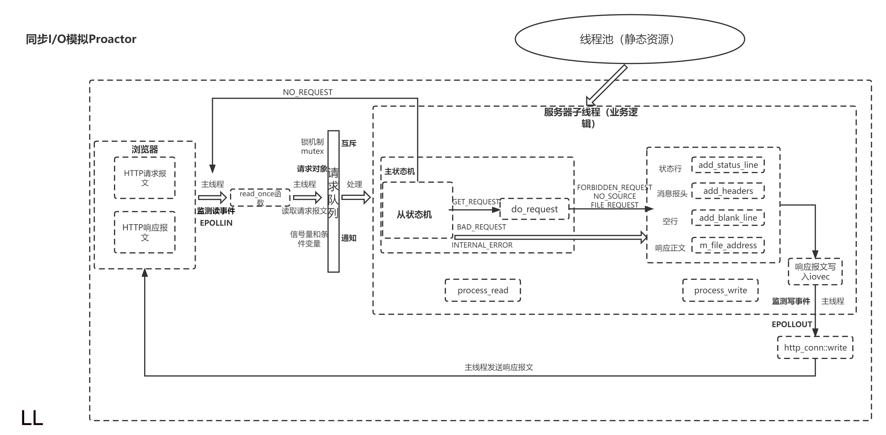
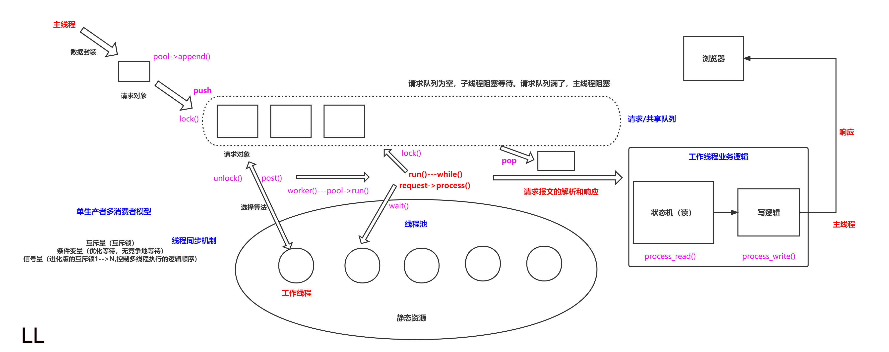
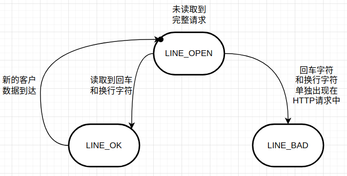
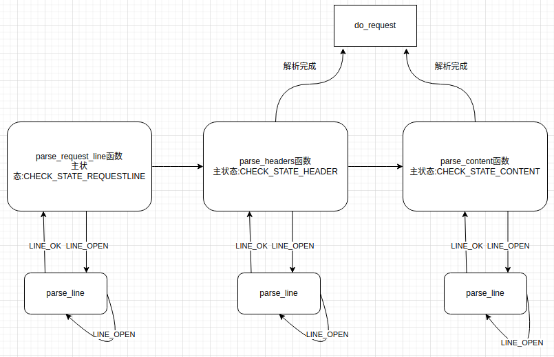
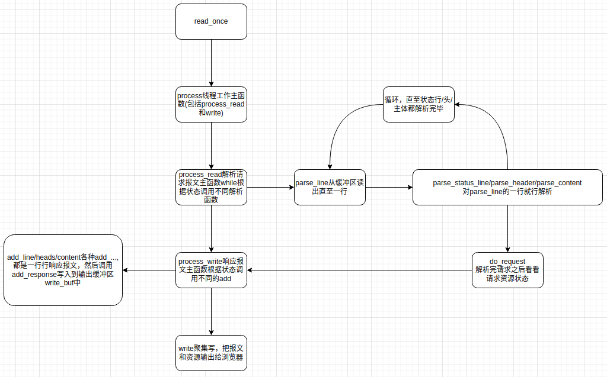
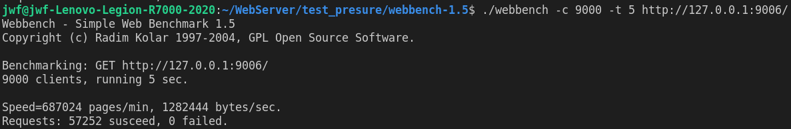
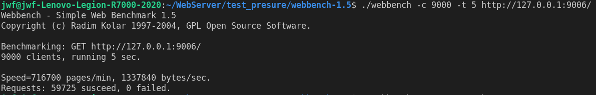
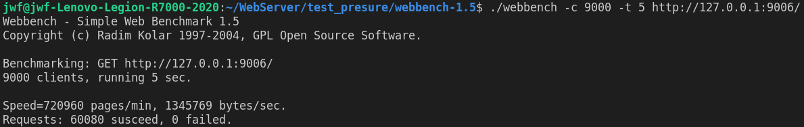
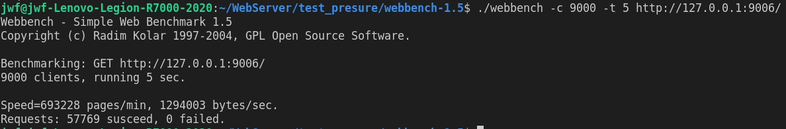
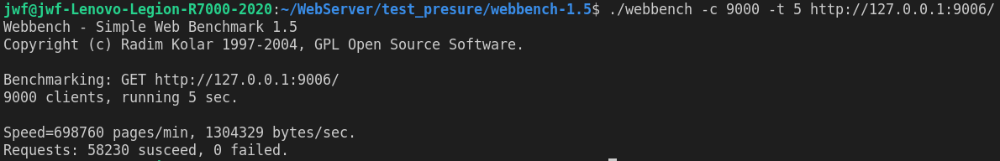

Linux下C++轻量级Web服务器
===============
目前实现了：

+ 系统启动时静态生成 8 个线程的线程池。
+ epoll 管理 I/O 事件。
+ 配合锁和信号量对任务队列进行管理 ( 线程池里的线程共享任务队列，任务队列采用 list 数据结构实现 )
+ 采用同步模拟proactor模式不同的线程从任务队列中对任务进行并发处理。
+ http/1.1 GET 请求资源响应。
+ HTTP POST 注册登陆过程向服务器推送相关信息。
+ 统一事件源，定时器定时清理不活跃连接。
+ 采用 RAII 手法处理数据库连接池的获取和释放。
+ 异步记录日志。


框架
-------------
<div align=center> </div>


## 线程池部分

使用一个工作队列完全解除了主线程和工作线程的耦合关系：主线程往工作队列中插入任务，工作线程通过竞争来取得任务并执行它。

添加任务时用到互斥锁，添加完成后通过信号量提醒有任务要处理。

1、构造函数完成线程池的初始化，产生了8个线程并且作出了分离

2、`m_poll`这个指针可以调用`append`函数来完成将事件入队的任务

3、`http_conn`给到了一个入口的作用，通过等待信号量来进入到`http`类里写出的`process`函数完成对于事务的处理，意味着以上三步走之后，半同步/半反应堆的模式达成。左侧有嗷嗷待哺的线程，右侧有反应堆。

<div align=center> </div>

## HTTP部分

根据状态转移,通过主从状态机封装了http连接类。其中,主状态机在内部调用从状态机,从状态机将处理状态和数据传给主状态机

* 客户端发出http连接请求

* 从状态机读取数据,更新自身状态和接收数据,传给主状态机

+ 主状态机根据从状态机状态,更新自身状态,决定响应请求还是继续读取

从状态机更专注于对于字符的过滤和判断，主状态机专注于对于整个文本块的判断与过滤。

在HTTP报文中，每一行的数据由\r\n作为结束字符，空行则是仅仅是字符\r\n。因此，可以通过查找\r\n将报文拆解成单独的行进行解析。从状态机负责读取buffer中的数据，将每行数据末尾的\r\n置为\0\0，并更新从状态机在buffer中读取的位置m_checked_idx，以此来驱动主状态机解析。

1. 从状态机:

+ 从状态机从m_read_buf中逐字节读取，判断当前字节是否为\r。
    + 接下来的字符是\n，将\r\n修改成\0\0，将m_checked_idx指向下一行的开头，则返回LINE_OK。
    + 接下来达到了buffer末尾，表示buffer还需要继续接收，返回LINE_OPEN。
    + 否则，表示语法错误，返回LINE_BAD。
    
+ 当前字节不是\r，判断是否是\n （一般是上次读取到\r就到了buffer末尾，没有接收完整，再次接收时会出现这种情况）
    + 如果前一个字符是\r，则将\r\n修改成\0\0，将m_checked_idx指向下一行的开头，则返回LINE_OK。
    
+ 当前字节既不是\r，也不是\n。
    + 表示接受的不完整，需要继续接受，返回LINE_OPEN。
    
    <div align=center> </div>

2. 主状态机:
   主状态机初始状态是CHECK_STATE_REQUESTLINE，通过调用从状态机来驱动主状态机，在主状态机进行解析前，从状态机已经将每一行的末尾\r\n符号改为\0\0，以便于主状态机直接取出对应字符串进行处理。

+ CHECK_STATE_REQUESTLINE，解析请求行
    + 主状态机的初始状态，调用parse_request_line函数解析请求行。
    + 解析函数从m_read_buf中解析HTTP请求行，获得请求方法、目标URL及HTTP版本号。
    + 解析完成后主状态机的状态变为CHECK_STATE_HEADER。
    
+ CHECK_STATE_HEADER，解析请求头
    + 调用parse_headers函数解析请求头部信息。
    + 判断是空行还是请求头，若是空行，进而判断content-length是否为0，如果不是0，表明是POST请求，则状态转移到CHECK_STATE_CONTENT，否则说明是GET请求，则报文解析结束。
    + 若解析的是请求头部字段，则主要分析connection字段，content-length字段，其他字段可以直接跳过，各位也可以根据需求继续分析。
    + connection字段判断是keep-alive还是close，决定是长连接还是短连接。
    + content-length字段，这里用于读取post请求的消息体长度。
    
+ CHECK_STATE_CONTENT，解析请求体
    + 仅用于解析POST请求，调用parse_content函数解析消息体。
    + 用于保存POST请求消息体，为后面的登陆和注册做准备。

<div align=center> </div>

整体的HTTP解析流程图：

<div align=center> </div>

## 定时器部分

定时器的作用：定时器处理非活动连接。

由于非活跃连接占用了连接资源，严重影响服务器的性能，通过实现一个服务器定时器，处理这种非活跃连接，释放连接资源。利用`alarm`函数周期性地触发`SIGALRM`信号,该信号的信号处理函数利用管道通知主循环执行定时器链表上的定时任务。

有一个定时器结点类`util`，每个结点表示一个客户连接，它保存了双向链表的前后指针，客户数据`client_data`和回调函数。如果判断到这个结点长时间无反应，所以我们调用这个回调函数传入`client_data`，然后回调函数就会把这个客户断开，并且做一些善后工作。

链表类`sort_timer_lst`，这个链表是一个时间递增的结点链表，即从链表头到尾这个客户的最后一次反应时间是递增的。这个链表类当然有插入和删除结点函数。并且还有`adjust_timer`调整链表位置函数，作用是当一个客户有了反应，那么需要更新他的最后一次反应时间，那么为了维护链表的递增特性，需要这么一个调整位置的函数。此外，这个类还有一个检查函数(定时清扫)，作用是统一了事件源，把信号回调函数逻辑搬到主函数执行，所以这个定时清扫检查逻辑就是在这个检查函数。主函数判断到信号来了，就执行这个函数进行检查链表中长时间无反应的结点进行清扫。

定时器具体执行过程：

（1） 首先使用`socketpair`创建管道。

（2） 设置写端为非阻塞，是为了减少信号处理的时间，即使定时事件失效也没关系，并不严格。

（3） 设置读端为`ET`非阻塞，向`epoll`树上挂读管道事件。

（4） 执行信号函数`addsig`，把信号添加到信号集当中，并把信号默认处理方式改成`sig_handler`函数(函数内容是向管道写入信号值)

（5） 设置`bool`值`timeout`和`stop_server`，后面需要使用他们判断是否执行信号对应的处理逻辑。

（6） 开始`alarm`函数，设定时间。

（7） 监听文件描述符`epoll_wait`。

（8） 监听到以后读出信号。

（9） 执行处理逻辑，如果信号是`SIGALRM`，`timeout=true`;如果是`SIGTERM（ctrl+c）stop_server=true`;

（10） 在`server.eventloop（）`（就是`epoll`树上监听到事件后的处理函数）中如果`timeout==true`,执行`time_handler`函数。

（11） `time_handler`函数(`Util`类中的)，首先执行`tick()`函数（定时器链表类中的），然后再次执行`alarm()`，相当于再次开始定时，一个`alarm`函数只能触发一次信号;

（12） `tick()`函数首先遍历定时器链表，找到到期的定时器（判断现在时间是否>`expire`，`expire`是定时器节点类中设定的超时时间），就是每过一段时间检查是否超时。即利用`alarm`函数周期性地触发`SIGALRM`信号,该信号的信号处理函数利用管道通知主循环执行定时器链表上的定时任务.

（13） 如果超时了就执行`cb_func`函数，删除`epoll`树上对应的通信`fd`，关闭通信`fd,http_conn`连接数-1；

（14） 项目中`TIMESLOT`值为5，`expire`初始值设置为 现有时间+3*`TIMESLOT`，每有读写事件发生，该通信`fd`对应的`expire`就加3个TIMESLOT，同时调整定时器链表类中该节点的位置，通过`util`类对象使用`adjust_timer`函数。

## 日志部分

日志的作用：有服务器创建，并记录运行状态，错误信息，访问数据的文件。

**同步日志**：日志写入函数与工作线程串行执行，由于涉及到I/O操作，当单条日志比较大的时候，同步模式会阻塞整个处理流程，服务器所能处理的并发能力将有所下降，尤其是在峰值的时候，写日志可能成为系统的瓶颈。

**生产者-消费者模型**：并发编程中的经典模型。以多线程为例，为了实现线程间数据同步，生产者线程与消费者线程共享一个缓冲区，其中生产者线程往缓冲区中push消息，消费者线程从缓冲区中pop消息。

**阻塞队列：**将生产者-消费者模型进行封装，使用循环数组实现队列，作为两者共享的缓冲区。

**异步日志**，将所写的日志内容先存入阻塞队列，写线程从阻塞队列中取出内容，写入日志。

**单例模式**，保证一个类只创建一个实例，同时提供全局访问的方法。

实现思路：私有化它的构造函数，以防止外界创建单例类的对象；使用类的私有静态指针变量指向类的唯一实例，并用一个公有的静态方法获取该实例。

懒汉模式(用到才初始化)和饿汉模式(一开始就进行初始化)

<font size = 4>**异步日志的实现：**</font>

使用循环数组模拟队列来存储日志，这个队列只是存储，真正的目的是要写到文件里，采用的异步IO就是先写到内存里，然后日志线程自己有空的时候写到文件里。

关键实现：日志队列和写日志的线程。

日志线程，这一部分也比较简单就是新建一个线程，这个线程不断while当日志队列有日志就从里面取出来写到文件去，这个过程记得加锁就行。

## 数据库连接池


压力测试
-------------
在关闭日志后，使用Webbench对服务器进行压力测试，对listenfd采用的LT，connfd采用ET，均可实现上千的并发连接，下面列出的是两者的测试结果。

> * Proactor

请求量：11450

<div align=center> </div>

请求量：11945

<div align=center> </div>

请求量：12016

<div align=center> </div>

请求量：11559

<div align=center> </div>

请求量：11656

<div align=center> </div>

> * 并发连接总数：9000
> * 访问服务器时间：5s
> * 平均请求量：11725
> * 所有访问均成功

**注意：** 使用本项目的webbench进行压测时，若报错显示webbench命令找不到，将可执行文件webbench删除后，重新编译即可。

快速运行
------------
* 服务器测试环境
	* Ubuntu版本18.04
	* MySQL版本8.0.28
	
* 浏览器测试环境
	* Windows、Linux均可
	* Chrome
	* FireFox
	
* 测试前确认已安装MySQL数据库

    ```C++
    // 建立yourdb库
    create database Jwfdb;

    // 创建user表
    USE Jwfdb;
    CREATE TABLE user(
        username char(50) NULL,
        passwd char(50) NULL
    )ENGINE=InnoDB;

    // 添加数据
    INSERT INTO user(username, passwd) VALUES('name', 'passwd');
    ```

* 修改main.cpp中的数据库初始化信息

    ```C++
    //数据库登录名,密码,库名
    string user = "root";
    string passwd = "123";
    string databasename = "Jwfdb";
    ```

* build

    ```C++
    cd build
    cmake ..
    make
    ```

* 启动server

    ```C++
    ./webserver
    ```

* 浏览器端

    ```C++
    ip:9006
    ```

个性化运行
------

```C++
./server [-p port] [-l LOGWrite] [-m TRIGMode] [-o OPT_LINGER] [-s sql_num] [-t thread_num] [-c close_log] [-a actor_model]
```

温馨提示:以上参数不是非必须，不用全部使用，根据个人情况搭配选用即可.

* -p，自定义端口号
	* 默认9006
* -l，选择日志写入方式，默认同步写入
	* 0，同步写入
	* 1，异步写入
* -m，listenfd和connfd的模式组合，默认使用LT + LT
	* 0，表示使用LT + LT
	* 1，表示使用LT + ET
    * 2，表示使用ET + LT
    * 3，表示使用ET + ET
* -o，优雅关闭连接，默认不使用
	* 0，不使用
	* 1，使用
* -s，数据库连接数量
	* 默认为8
* -t，线程数量
	* 默认为8
* -c，关闭日志，默认打开
	* 0，打开日志
	* 1，关闭日志
* -a，选择反应堆模型，默认Proactor
	* 0，Proactor模型
	* 1，Reactor模型

测试示例命令与含义

```C++
./server -p 9007 -l 1 -m 0 -o 1 -s 10 -t 10 -c 1 -a 1
```
